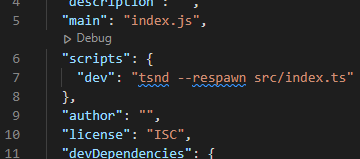

# Getting Started
  1. [Purpose of the app](#Purpose-of-the-app)
  1. [Starting the app](#Starting-the-app)
  1. [Interacting with the app](#Interacting-with-the-app)
  1. [Completed version](#Completed-version)

---

# Purpose of the app
The purpose of this app is to showcase simple routing and endpoints using Express.js! In the base branch (main) you will find a template of sorts in order to practice creating endpoints and create a working back-end!

---

# Starting the app
If you are simply looking to run the completed app, check out the section on the completed version [below](#Where-can-I-find-the-completed-version?)

To setup the app for practice, a few commands will need to be run to get started:

## Setting up the environment
1. First things first, make sure you have a terminal to execute the next series of commands inside of. I recommend [git](https://git-scm.com/downloads) as it is a solid terminal, and can be used inside of VS Code.

2. Next, go ahead and clone the repo either using the [GitHub Desktop App](https://desktop.github.com/) or cloning it with the command `git clone https://github.com/Ulfingrad/UtdTalkBackendPortion.git`

3. Afterwards, make sure that you have [Node.js](https://nodejs.org/en/download/) installed before doing anything! You WILL NOT be able to run the next series of commands if you do not have Node.js installed.

4. Install Typescript globally by entering `npm install -g typescript` into the console

5. Run the command `npm init`, answer any prompts that appear in the console (the only one really mattering being the package name) and then run `tsc --init`

6. In no particular order, install the required dependencies using these commands:
    * `npm install cors`
    * `npm install --save @types/cors`
    * `npm i ts-node-dev --save-dev`
    * `npm install express --save`
    * `npm install --save @types/express`
    * `npm install typescript --save-dev`

7. Inside of the `package.json` file inside of the `scripts` section (specifically in the curly braces), create a new script and have its value be `tsnd --respawn src/index.ts`

In this example I have created a script called `dev`, but realistically this can be named anything you want!

8. Run the command `npm run YOUR_SCRIPT_NAME` and the app should be ready to be interacted with/built!

9. As you build out and save your app, it should automatically restart in order to make changing elements of your app quick and easy.
---

# Interacting with the app
Don't have the front-end portion of the app set up yet? No worries! You can interact with the api you have just created using a piece of software called [insomnia](https://insomnia.rest/).

---

# Completed version
The completed version of this app is just in a separate branch! Go to the Github repo (which can be found [here](https://github.com/Ulfingrad/UtdTalkBackendPortion))

In order to get the completed app up and running first make sure you have completed the first 3 steps in the [Setting up the environment ](##Setting-up-the-environment) section.

Afterwards, simply type `npm i` then `npm run dev` and the app should be up and running!

---